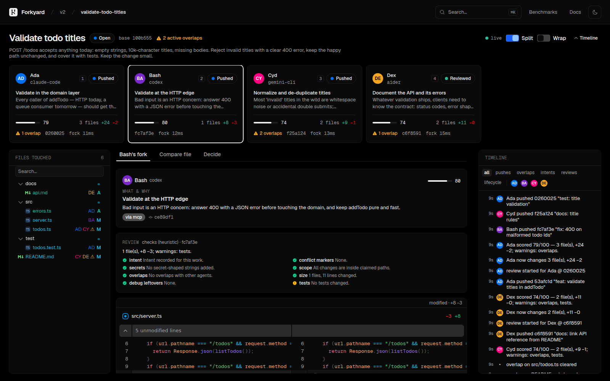
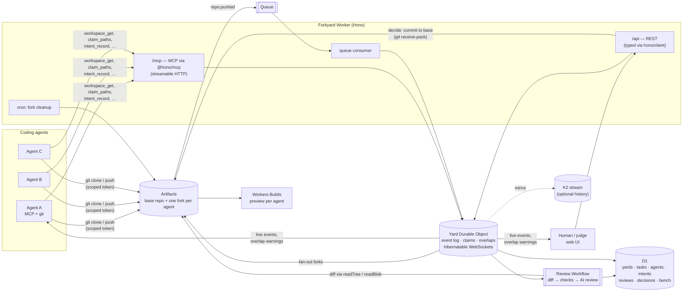

# Forkyard

**An agent-native Git platform on Cloudflare.** A task fans out to several coding agents; each one gets its own [Artifacts](https://developers.cloudflare.com/artifacts/) fork, a scoped git token and the project's `AGENTS.md`. Forkyard tells agents when they are about to collide *while they work*, reviews every push, and lets a human (or a judge agent) compare the forks side by side and ship one — or assemble hunks from several.

Agents are the primary users: every UI action is an MCP tool and a REST route, and plain `git clone` / `git push` is all an agent needs to work. Humans watch, compare and decide.

Built for Cloudflare's [“Build the next Git platform”](https://blog.cloudflare.com/next-git-platform-on-cloudflare/) competition. MIT licensed.



| Compare one file across agents | Decide: assemble hunks, preview, apply |
| --- | --- |
|  |  |

## Quick start

Requirements: Node 22+, pnpm 10, git.

```sh
pnpm install
pnpm dev          # worker (API, MCP, git) on :8787 and the UI on http://localhost:5173
pnpm seed         # in another terminal: a yard, a task, four agents working concurrently
```

`pnpm dev` needs **no Cloudflare account**: the Artifacts binding (which has no local simulator) is replaced by a local emulator Durable Object that speaks real git smart HTTP, so the seed's scripted agents — and any real agent — can `git clone` and `git push` against it. Queues, Workflows, D1 and Durable Objects run in `wrangler dev`.

Other scripts:

| Command | What it does |
| --- | --- |
| `pnpm seed [--pace=fast\|demo\|slow] [--no-decide] [--yard=id]` | Demo story for the video: 4 agents, small commits pushed concurrently, a claim overlap, a change overlap, reviews, and an assembled decision. |
| `pnpm e2e [--cleanup]` | Runs the seed and asserts 25 things: fan-out, overlaps, git-sourced intents, reviews, decision, MCP tool parity, permissions (agents can't decide, can't touch other tasks, fork tokens can't reach the base repo), and cron cleanup. |
| `pnpm bench:fork [--levels=1,5,20,50 --rounds=3]` | Fork latency at 1/5/20/50 concurrent forks, p50/p95/p99. |
| `pnpm bench:events [--pushes=20] [--k2]` | `git push` → event on a WebSocket (what the UI sees); optional K2 spike numbers. |
| `pnpm cleanup [--ttl=0] [--abandon-open=72]` | Delete stale forks (run before Artifacts billing starts on **October 15**). |
| `pnpm test` / `pnpm typecheck` | Unit tests (git protocol against the real `git` CLI, overlap detection, hunk assembly) and types. |

## Deploy

1. Create the D1 database and a queue, and put the D1 id into `apps/worker/wrangler.jsonc` → `env.production`:
   ```sh
   cd apps/worker
   npx wrangler d1 create forkyard
   npx wrangler queues create forkyard-artifact-events
   ```
2. Create an Artifacts namespace `forkyard` (or edit the `artifacts` binding), and subscribe the queue to its events:
   ```sh
   npx wrangler queues subscription create forkyard-artifact-events --source artifacts.repo --events pushed
   ```
   The docs show the fully-qualified `cf.artifacts.repo.pushed`, but other builders report that the subscriptions API currently accepts only the bare suffix; if `pushed` is rejected, use `cf.artifacts.repo.pushed`. Either way, messages arrive with `type: "cf.artifacts.repo.pushed"`.
3. Secrets: `npx wrangler secret put FORKYARD_ADMIN_KEY --env production` (for orchestrators and the seed script), and/or put the Worker behind **Cloudflare Access** and set `ACCESS_TEAM_DOMAIN` + `ACCESS_AUD`.
4. `pnpm deploy` (builds the UI, applies D1 migrations, deploys `--env production`).
5. Optional: connect the base repos to **Workers Builds** (Settings → Builds, enable Preview builds) and set each yard's preview URL template, e.g. `https://{branch}-myapp.<subdomain>.workers.dev`. Forkyard mirrors every agent's latest push to a `fy/<task>/<agent>` branch so each fork gets its own Preview URL.
6. Seed and benchmark the deployment:
   ```sh
   FORKYARD_URL=https://forkyard.<subdomain>.workers.dev FORKYARD_ADMIN_KEY=… pnpm seed
   FORKYARD_URL=… FORKYARD_ADMIN_KEY=… pnpm bench:fork && pnpm bench:events
   ```

## How it works



- **Yard** = one base Artifacts repo plus everything happening around it. One **Durable Object per yard** owns the live, ordered state: the event log (gap-free offsets for `events_since`), path claims, per-agent footprints, overlap detection, in-flight forks and WebSockets (Hibernation API).
- **Task fan-out.** The Yard DO starts all N `repo.fork("<yard>--<task>--<agent>")` calls concurrently and resolves each agent's workspace as soon as *its own* fork is ready (`POST /api/yards/:yard/tasks?stream=1` streams them as NDJSON in completion order). Per-fork latency is recorded on every agent.
- **Overlaps.** Claims (`claim_paths`, globs allowed) and actual changes (from each push's diff) are compared pairwise. `claim` overlaps are early warnings; `change` overlaps are files two agents both changed (or one changed inside another's claim). New overlaps are pushed to the involved agents' sockets, returned by `claim_paths`, and shown in the UI.
- **Pushes.** Artifacts emits `cf.artifacts.repo.pushed` → Queue → Worker → Yard DO (event + head update) → **Review Workflow**: diff fork vs base straight from Artifacts objects (hash-skipping identical subtrees), publish the footprint, pick up `.forkyard/intent.md` from the commit, run checks (conflict markers, secrets, scope vs claims, overlaps, size, debug leftovers, tests), ask a Workers AI model for a review when bound, and store the score.
- **Intents** are recorded over MCP and also travel in the fork as `.forkyard/intent.md`; the latest one is attached to the next push and shown *above* the agent's diff.
- **Decide.** Pick a winner, or select hunks from several forks; Forkyard previews the combined result with conflicts, then writes one commit to the base branch with a compare-and-swap ref update and `Co-authored-by` lines for the agents. The Artifacts binding has no write API, so this uses a small git smart-HTTP client (`apps/worker/src/git/`).
- **Cleanup.** An hourly cron deletes forks (and preview branches) of decided or abandoned tasks after `FORK_TTL_HOURS`, revokes their keys, and logs `fork.deleted`. `pnpm cleanup` sweeps on demand.

### For agents

Point any MCP-capable coding agent at `/mcp` with its key (`Authorization: Bearer fy_…`). `/llms.txt` and `/AGENTS.md` explain the workflow.

| Tool | REST twin |
| --- | --- |
| `yard_list` / `yard_create` | `GET` / `POST /api/yards` |
| `yard_status` | `GET /api/yards/:yard` |
| `task_create` | `POST /api/yards/:yard/tasks` |
| `workspace_get` | `GET …/agents/:agent/workspace` |
| `claim_paths` / `release_paths` | `POST …/agents/:agent/claims` / `…/claims/release` |
| `intent_record` | `POST …/agents/:agent/intents` |
| `events_since` | `GET /api/yards/:yard/events?since=` (+ WebSocket `/api/yards/:yard/ws`) |
| `compare_forks` | `GET …/tasks/:task/compare` and `…/compare/file?path=` |
| `review_get` | `GET …/agents/:agent/reviews` |
| `decide_preview` / `decide` | `POST …/tasks/:task/decide/preview` / `…/decide` |
| `task_abandon` | `POST …/tasks/:task/abandon` |
| `bench_fork` | `POST /api/bench/fork` |

With an agent key, ids default to the key's scope, so `workspace_get` takes no arguments. Agent keys are scoped to one task; only humans, admin keys and `judge` agents can decide. Fork tokens are scoped to one fork and expire; agents never get the base repo's write path.

### For humans

- **Task view**: one card per fork — agent name *and* initials with a stable color (never color alone), status, intent summary, review score, files and +/−, preview link, overlap count.
- **File tree** (`@pierre/trees`): the union of files touched across forks, each row with the initials of every agent that touched it and ⚠ when more than one did.
- **Diffs** (`@pierre/diffs`): split/unified, word-level highlights, syntax highlighting, collapsed unchanged regions, files mounted lazily as you scroll. Each hunk is labeled with its agent and intent.
- **Compare** a file across all agents, side by side against base. **Decide** by winner or hunk assembly, with a preview before applying.
- **Timeline** of yard events, filterable by agent and kind; everything updates live over the yard WebSocket.
- **Keyboard**: ⌘K / Ctrl+K command palette, `[` `]` between agents, `1`–`9` to jump to a fork, `j` `k` between hunks, `a` `c` `d` for views, `s` split, `w` wrap, `t` timeline.
- **Theme**: light / dark / system, remembered; Kumo tokens, diffs and the tree all follow the same mode.
- **Design**: the look follows [`DESIGN.md`](DESIGN.md) — a Vercel-inspired system (Geist / Geist Mono, ink-on-near-white, hairline cards with stacked shadows, mono eyebrows). Its tokens are mapped onto Kumo's theme variables in `apps/web/src/styles.css`, so Kumo components render in that language; app-specific rules are at the end of DESIGN.md.

## Numbers

Measured with the scripts above. **The local rows use the Artifacts emulator under `wrangler dev` and only show Forkyard's own overhead**; production rows need an Artifacts beta account and are produced by the same scripts (they land in `bench-results/` and on the in-app Benchmarks page).

**Fork latency** (`pnpm bench:fork`, forks issued concurrently inside the Worker):

| Concurrent forks | p50 | p95 | p99 | Environment |
| --- | --- | --- | --- | --- |
| 1 | 2 ms | 2 ms | 2 ms | local emulator |
| 5 | 4 ms | 7 ms | 7 ms | local emulator |
| 20 | 10 ms | 16 ms | 21 ms | local emulator |
| 50 | 20 ms | 36 ms | 45 ms | local emulator |
| 1 / 5 / 20 / 50 | _pending a deployment run_ | | | Cloudflare Artifacts |

**Event latency** (`pnpm bench:events`, `git push` → event on a WebSocket):

| Path | p50 | p95 | p99 | Environment |
| --- | --- | --- | --- | --- |
| Live: Queue → Yard DO → WebSocket (incl. the push) | 42 ms | 48 ms | 76 ms | local |
| Live: after `git push` returns | 8 ms | 12 ms | 13 ms | local |
| Live, production | _pending a deployment run_ | | | Cloudflare |
| K2 (produce + polling), published beta figures | — | ~2.5 s | ~7.5 s | Cloudflare |

**K2 decision** ([docs/decisions/events.md](docs/decisions/events.md)): everything live (pushes, overlaps, review status) stays on **Queues + Durable Object WebSockets**; K2's published end-to-end latency is above the 1 s budget, its consumers are pull-only, and Artifacts can't deliver events to it. K2 is wired in as an optional durable mirror (producer on every yard event, pull consumer on a DO alarm, latency stats at `/api/yards/:yard/latency`). Re-evaluate when K2 becomes an Artifacts event destination with push consumers.

**Warm fork pool**: not built — see [docs/decisions/fork-pool.md](docs/decisions/fork-pool.md) for the rule (build it if p95 at 5 concurrent forks exceeds ~1 s on a deployment).

## Repository layout

```
apps/worker      Hono Worker: REST, MCP, Yard DO, review Workflow, queue + cron, git client/server, Artifacts emulator
apps/web         Vite + React + Kumo UI (@pierre/diffs, @pierre/trees)
packages/shared  zod schemas, the YardEvent log schema, overlap detection, hunk assembly, AGENTS.md / llms.txt text
scripts          seed, e2e, bench-fork, bench-events, cleanup
docs             decisions (events, fork pool), platform notes, demo video script
```

## Notes and limits

- APIs were verified against the shipped `@cloudflare/workers-types`, Wrangler and package sources; differences from the original brief are listed in [docs/platform-notes.md](docs/platform-notes.md) (most notably: the Artifacts binding is read-only for content, Artifacts events can target Workflows directly, and Workers Builds connects one repo — hence preview branches mirrored into the base repo).
- Budgets: per-yard `maxAgentsPerTask` and `maxActiveForks` (defaults 8 and 40) cap fan-out once billing starts.
- Data jurisdiction: create a yard with `jurisdiction: "eu"` to use an EU Artifacts namespace (`ARTIFACTS_EU` binding) and an EU Durable Object.
- The hunk assembler is line-based and refuses binary files; a decision is refused if the base branch moved and also changed one of the decided files.

## License

[MIT](LICENSE)
