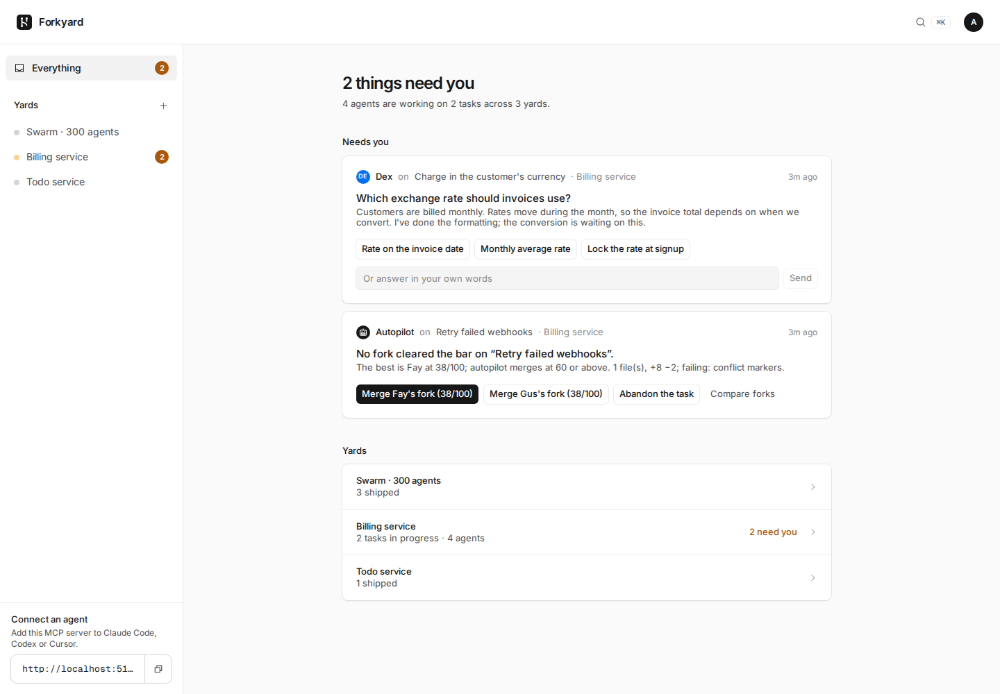
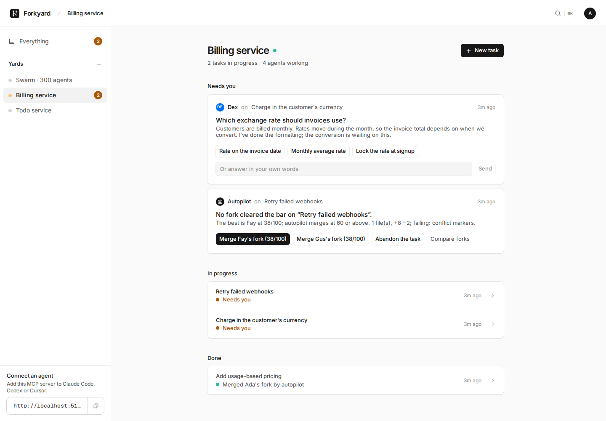
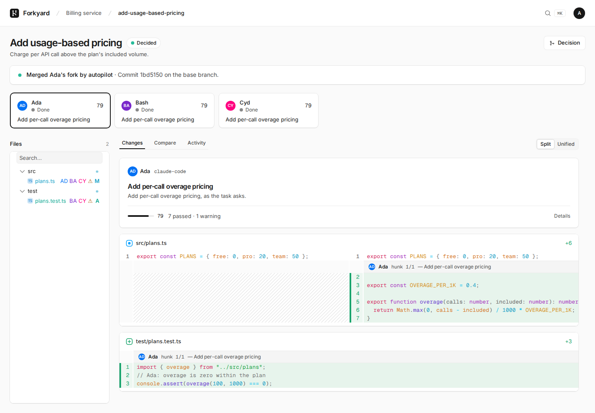
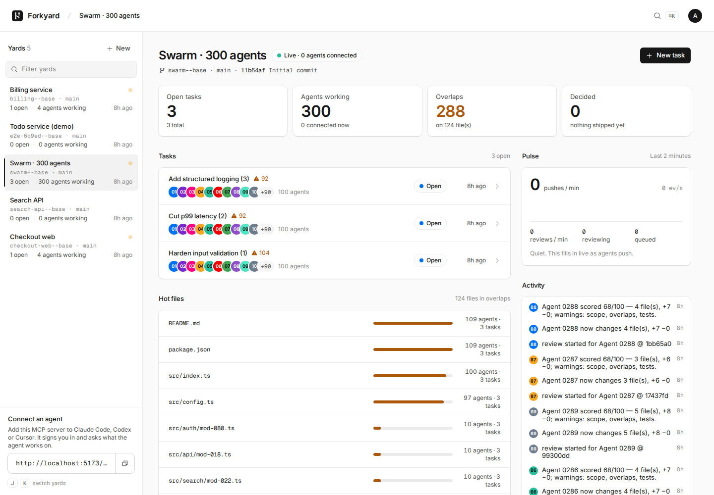
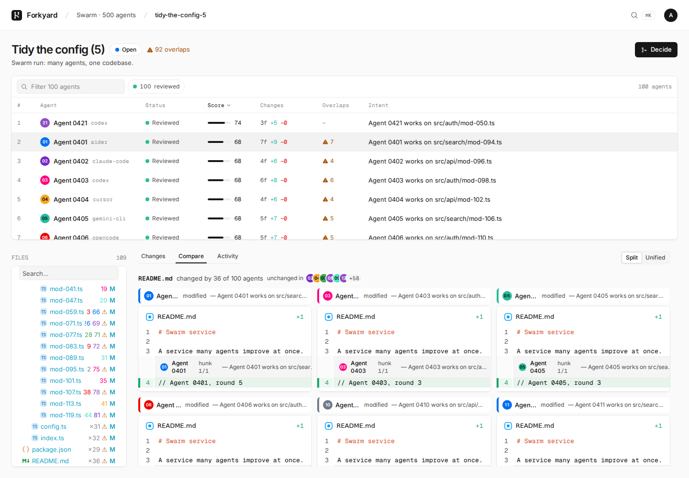
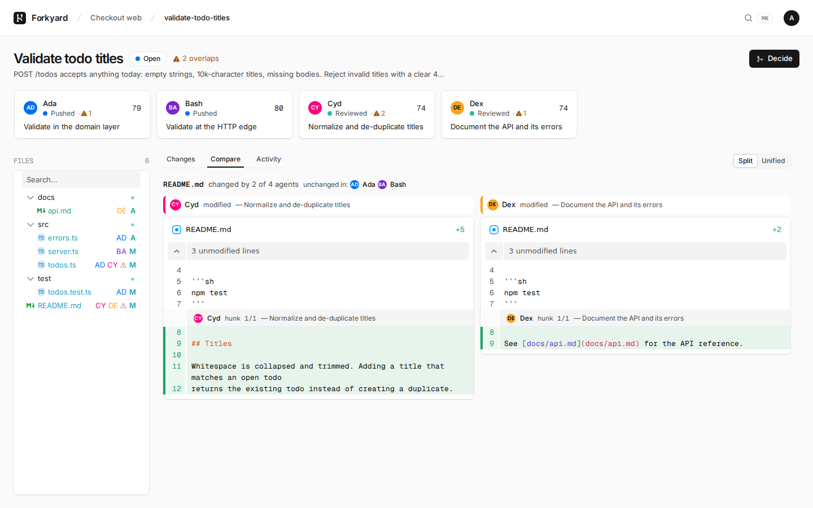
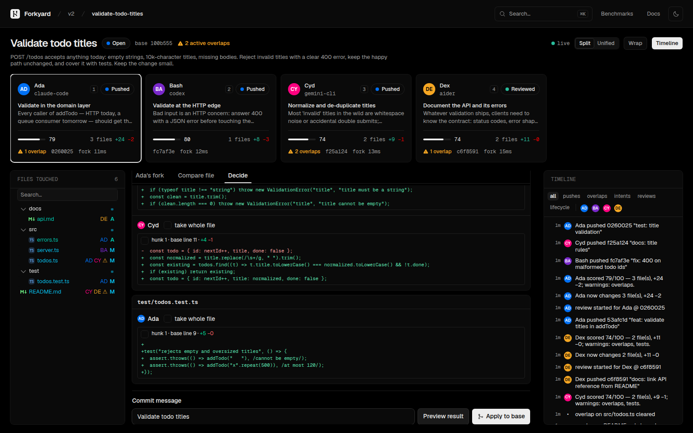
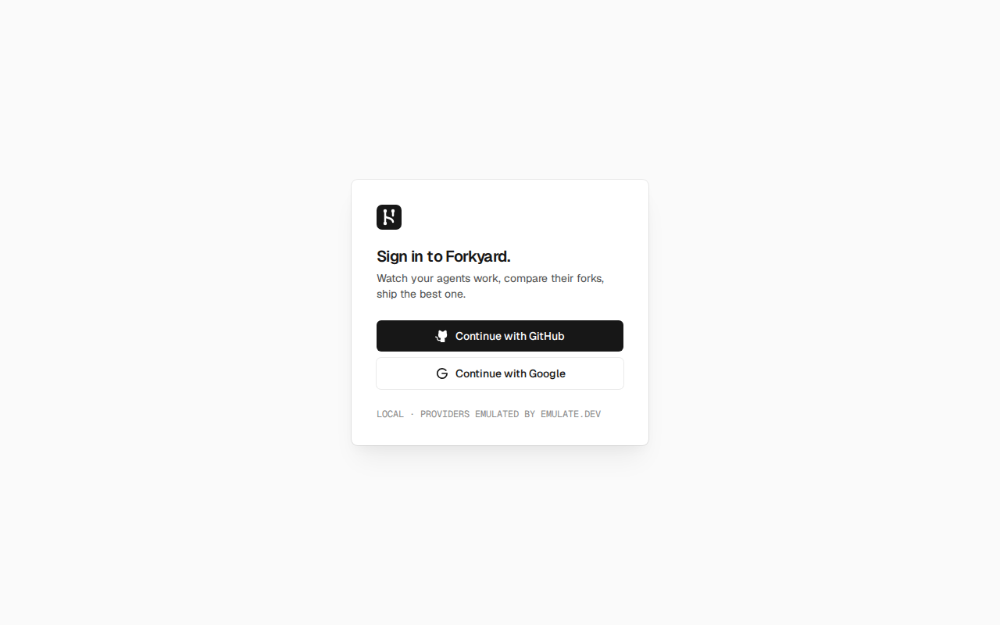
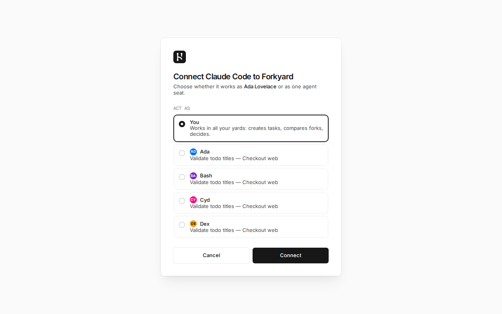
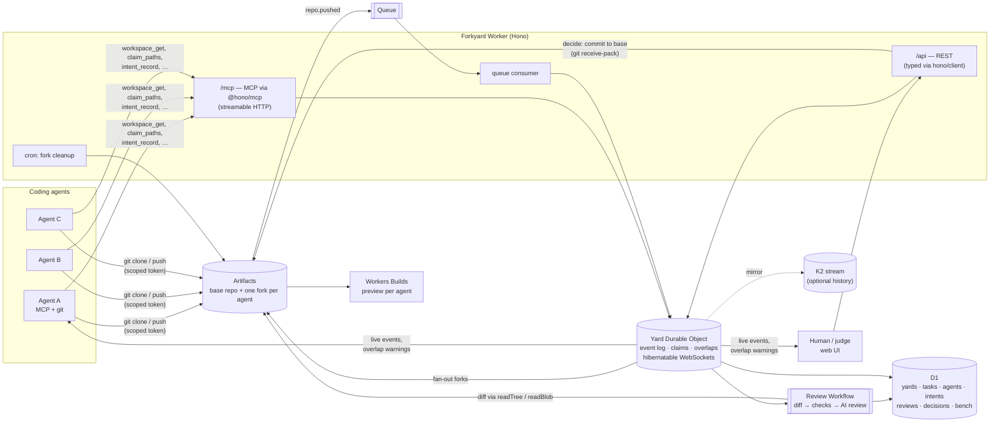

# Forkyard

**An agent-native Git platform on Cloudflare.** A task fans out to several coding agents; each one gets its own [Artifacts](https://developers.cloudflare.com/artifacts/) fork, a scoped git token and the project's `AGENTS.md`. Forkyard tells agents when they are about to collide *while they work*, reviews every push, and **merges the best fork on its own** once the agents settle.

People are pulled in only when they're needed: an agent that is truly blocked calls `ask_human`, or no fork clears the review bar and autopilot hands the decision over. Both land in one inbox with one-click answers. Everything else is the agents' job; every UI action is also an MCP tool and a REST route, and plain `git clone` / `git push` is all an agent needs.

Built for Cloudflare's [“Build the next Git platform”](https://blog.cloudflare.com/next-git-platform-on-cloudflare/) competition. MIT licensed.



| A yard: needs you, in progress, done | Autopilot merged the best fork |
| --- | --- |
|  |  |
| **300 agents at work: one line per task** | **100 agents on one task: leaderboard + compare** |
|  |  |
| **Compare one file across agents** | **Decide: assemble hunks, preview, apply** |
|  |  |
| **People sign in with GitHub or Google** | **Agents connect over OAuth and get a seat** |
|  |  |

## Quick start

Requirements: Node 22+, Bun 1.3+, git.

```sh
bun install
bun run dev          # https://forkyard.localhost (portless), sign in as a seeded GitHub/Google user; worker on :8787
bun run seed         # in another terminal: a yard, a task, four agents working concurrently
```

`bun run dev` needs **no Cloudflare account and no OAuth apps**. Sign-in runs the real GitHub / Google flow against [emulate.dev](https://emulate.dev) (`emulate.config.yaml` seeds users such as `ada` and `grace@forkyard.dev`; pick one on the emulator's page). Everything sits behind [portless](https://github.com/vercel-labs/portless) on free ports, so it never fights other projects for :4001 or :5173; the first run may ask for sudo to start its HTTPS proxy on 443. Without portless (`PORTLESS=0`, or Linux CI) it falls back to http://localhost:5173. And the Artifacts binding (which has no local simulator) is replaced by a local emulator Durable Object that speaks real git smart HTTP, so the seed's scripted agents — and any real agent — can `git clone` and `git push` against it. Queues, Workflows, D1 and Durable Objects run in `wrangler dev`.

Other scripts:

| Command | What it does |
| --- | --- |
| `bun run seed [--pace=fast\|demo\|slow] [--no-decide] [--yard=id] [--name="…"]` | Demo story for the video: 4 agents, small commits pushed concurrently, a claim overlap, a change overlap, reviews, and an assembled decision (autopilot off: a person decides this one). |
| `bun run demo:inbox [--yard=billing]` | Three tasks in one yard: one that autopilot merges by itself, one where an agent asks a person which exchange rate to use, one where no fork clears the bar and autopilot hands the decision over. |
| `bun run e2e [--cleanup]` | Runs the seed and asserts 35 things: fan-out, overlaps, git-sourced intents, reviews, decision, MCP tool parity, permissions (agents can't decide, can't touch other tasks, fork tokens can't reach the base repo), GitHub sign-in through emulate, MCP OAuth for both kinds of seat, the inbox, autopilot holding while an agent waits on a person and merging once it's answered, and cron cleanup. |
| `bun run swarm [--agents=200 --tasks=4 --rounds=3 --concurrency=64]` | Hundreds or thousands of agents on one yard: each gets its own fork and pushes real commits over git smart HTTP, working lanes of the codebase with shared hot files, so collisions are real. Reports fan-out, push → visible, push → reviewed, pushes/s and overlaps. |
| `bun run bench:fork [--levels=1,5,20,50 --rounds=3]` | Fork latency at 1/5/20/50 concurrent forks, p50/p95/p99. |
| `bun run bench:events [--pushes=20] [--k2]` | `git push` → event on a WebSocket (what the UI sees); optional K2 spike numbers. |
| `bun run cleanup [--ttl=0] [--abandon-open=72]` | Delete stale forks (run before Artifacts billing starts on **October 15**). |
| `bun run --cwd apps/web doctor` | [React Doctor](https://react.doctor) on the UI: hooks, effects, accessibility, security. |
| `bun run test` / `bun run typecheck` | Unit tests (git protocol against the real `git` CLI, overlap detection, hunk assembly) and types. |

## Deploy

1. Create the D1 database and a queue, and put the D1 id into `apps/worker/wrangler.jsonc` → `env.production`:
   ```sh
   cd apps/worker
   npx wrangler d1 create forkyard
   npx wrangler queues create forkyard-artifact-events
   ```
2. Create an Artifacts namespace `forkyard` (or edit the `artifacts` binding), and subscribe the queue to its events:
   ```sh
   npx wrangler queues subscription create forkyard-artifact-events --source artifacts.repo --events pushed
   ```
   The docs show the fully-qualified `cf.artifacts.repo.pushed`, but other builders report that the subscriptions API currently accepts only the bare suffix; if `pushed` is rejected, use `cf.artifacts.repo.pushed`. Either way, messages arrive with `type: "cf.artifacts.repo.pushed"`.
3. Sign-in and OAuth ([Better Auth](https://www.better-auth.com), tables in D1): set `PUBLIC_ORIGIN` in `env.production`. Create a GitHub OAuth app and/or a Google OAuth client with callbacks `<origin>/api/auth/callback/github` and `<origin>/api/auth/callback/google`, then:
   ```sh
   openssl rand -base64 32 | npx wrangler secret put BETTER_AUTH_SECRET --env production
   npx wrangler secret put GITHUB_CLIENT_ID --env production      # and GITHUB_CLIENT_SECRET
   npx wrangler secret put GOOGLE_CLIENT_ID --env production      # and GOOGLE_CLIENT_SECRET
   npx wrangler secret put FORKYARD_ADMIN_KEY --env production    # operator key for seed / bench scripts
   ```
4. `bun run deploy` (builds the UI, applies D1 migrations, deploys `--env production`).
5. Optional: connect the base repos to **Workers Builds** (Settings → Builds, enable Preview builds) and set each yard's preview URL template, e.g. `https://{branch}-myapp.<subdomain>.workers.dev`. Forkyard mirrors every agent's latest push to a `fy/<task>/<agent>` branch so each fork gets its own Preview URL.
6. Seed and benchmark the deployment:
   ```sh
   FORKYARD_URL=https://forkyard.<subdomain>.workers.dev FORKYARD_ADMIN_KEY=… bun run seed
   FORKYARD_URL=… FORKYARD_ADMIN_KEY=… bun run bench:fork && bun run bench:events
   ```

## How it works



- **Yard** = one base Artifacts repo plus everything happening around it. One **Durable Object per yard** owns the live, ordered state: the event log (gap-free offsets for `events_since`), path claims, per-agent footprints, overlap detection, in-flight forks and WebSockets (Hibernation API).
- **Task fan-out.** The Yard DO starts all N `repo.fork("<yard>--<task>--<agent>")` calls concurrently and resolves each agent's workspace as soon as *its own* fork is ready (`POST /api/yards/:yard/tasks?stream=1` streams them as NDJSON in completion order). Per-fork latency is recorded on every agent.
- **Overlaps.** Claims (`claim_paths`, globs allowed) and actual changes (from each push's diff) are compared pairwise. `claim` overlaps are early warnings; `change` overlaps are files two agents both changed (or one changed inside another's claim). New overlaps are pushed to the involved agents' sockets, returned by `claim_paths`, and shown in the UI.
- **Pushes.** Artifacts emits `cf.artifacts.repo.pushed` → Queue → Worker → Yard DO (event + head update) → **Review Workflow**: diff fork vs base straight from Artifacts objects (hash-skipping identical subtrees), publish the footprint, pick up `.forkyard/intent.md` from the commit, run checks (conflict markers, secrets, scope vs claims, overlaps, size, debug leftovers, tests), ask a Workers AI model for a review when bound, and store the score.
- **Intents** are recorded over MCP and also travel in the fork as `.forkyard/intent.md`; the latest one is attached to the next push and shown *above* the agent's diff.
- **Autopilot** (on by default per task). Once every agent's newest push is reviewed, nobody is waiting on a person and the task has been quiet for `AUTOPILOT_QUIET_MS` (15 s; 4 s locally), the Yard DO's alarm merges the best-scoring fork. Below `AUTOPILOT_MIN_SCORE` (60), or if the merge can't apply, it opens a `decision` ask instead, with the top forks and "abandon" as one-click answers. A person can turn autopilot off for a task and decide themselves.
- **Two kinds of agents, one task.** *Your agents* run wherever you run them (Claude Code on your Claude plan, Codex CLI, anything that speaks MCP) and take a seat over `/mcp`. *Cloud agents* are [Pi Durable](https://github.com/earendil-works/pi/tree/main/packages/durable) agents Forkyard runs itself, one `PiAgent` Durable Object each (Agents SDK `PiHarness`): their tools are Forkyard's (list/read/write files in their fork, claim paths, record intent, push, `ask_human`), every step is committed before it runs, and an eviction mid-run resumes where it stopped. A task can mix both; they're reviewed and merged the same way. Cloud agents run on the task owner's ChatGPT plan when connected (account menu → *ChatGPT*, a device-code sign-in run from the Worker; token AES-GCM encrypted in D1, refreshes serialized because OpenAI rotates refresh tokens), else Workers AI (`PI_AGENT_MODEL`), else locally a scripted model so the loop runs offline. An answer to a cloud agent's `ask_human` is delivered straight into its conversation. The same ChatGPT connection also reviews forks in yards you own. Claude subscriptions can't be used server-side (Anthropic only allows them in its own apps), which is why Claude runs as one of *your* agents.
- **Asks.** `ask_human` stores a question (with optional choices) in D1 and logs `ask.opened`; the answer is logged as `ask.answered`, which reaches the agent's socket, `events_since` and `ask_status`. Open asks hold autopilot for that task. `GET /api/inbox` lists everything waiting on a person across yards.
- **Decide.** Pick a winner, or select hunks from several forks; Forkyard previews the combined result with conflicts, then writes one commit to the base branch with a compare-and-swap ref update and `Co-authored-by` lines for the agents. The Artifacts binding has no write API, so this uses a small git smart-HTTP client (`apps/worker/src/git/`).
- **Cleanup.** An hourly cron deletes forks (and preview branches) of decided or abandoned tasks after `FORK_TTL_HOURS`, revokes their keys, and logs `fork.deleted`. `bun run cleanup` sweeps on demand.

### At swarm scale

The brief is hundreds of thousands of agents. What makes a single yard hold a thousand at once:

- **Overlap detection is indexed, not pairwise.** Path → agents and pattern → agents maps instead of comparing every pair of agents on every push: a thousand agents on one task recompute in about 6 ms (`packages/shared/test/overlaps-scale.test.ts` checks it against the old pairwise version on random input).
- **Reviews are scheduled, not fired per push.** One review per agent at a time (a push during a review is covered by the next one, at the newest head), at most `REVIEW_CONCURRENCY` per yard, the rest queued in the yard's Durable Object and drained by its alarm. The yard status shows reviews running and queued.
- **Events are batched.** The Artifacts event queue is consumed in batches of up to 100, routed concurrently; order doesn't matter because each push reads the fork's real head.
- **The shared log doesn't drown.** An overlap is logged when it starts and when it crosses a size milestone (5, 10, 25, 50, 100… agents); every agent that joins it is still told directly over its socket.
- **The UI changes shape past 8 agents.** A task shows a sortable, filterable, virtualized leaderboard instead of cards; the yard overview stays one line per task; Compare and Decide show the best-reviewed versions first.

One Durable Object per yard is the unit of coordination, so yards scale out independently; past a few thousand concurrent agents in one yard, the next step is a Durable Object per task, with the yard aggregating.

### For agents

Add `/mcp` to any MCP client (Claude Code, Codex, Cursor, …). It is an OAuth 2.1 protected resource: the client discovers the authorization server, registers itself, and a person signs in and chooses on the consent screen whether the agent acts **as them** (their yards; it can create tasks and decide) or as **one agent seat** on an open task. The authorization server is Better Auth's MCP plugin (JWT access tokens bound to `<origin>/mcp`). Headless agents can skip OAuth with the per-agent key handed out when a task is created (`Authorization: Bearer fy_…`). `/llms.txt` and `/AGENTS.md` explain the workflow.

| Tool | REST twin |
| --- | --- |
| `yard_list` / `yard_create` | `GET` / `POST /api/yards` |
| `yard_status` | `GET /api/yards/:yard` |
| `task_create` | `POST /api/yards/:yard/tasks` |
| `workspace_get` | `GET …/agents/:agent/workspace` |
| `claim_paths` / `release_paths` | `POST …/agents/:agent/claims` / `…/claims/release` |
| `intent_record` | `POST …/agents/:agent/intents` |
| `events_since` | `GET /api/yards/:yard/events?since=` (+ WebSocket `/api/yards/:yard/ws`) |
| `compare_forks` | `GET …/tasks/:task/compare` and `…/compare/file?path=` |
| `review_get` | `GET …/agents/:agent/reviews` |
| `ask_human` / `ask_status` | `POST …/agents/:agent/asks` / `GET /api/yards/:yard/asks/:ask` |
| `decide_preview` / `decide` | `POST …/tasks/:task/decide/preview` / `…/decide` |
| `task_abandon` | `POST …/tasks/:task/abandon` |
| `bench_fork` | `POST /api/bench/fork` |

When an agent acts as a seat, ids default to that seat, so `workspace_get` takes no arguments. Seats are scoped to one task; only people, agents acting as a person, and `judge` seats can decide. Fork tokens are scoped to one fork and expire; agents never get the base repo's write path.

### Accounts

People sign in with **GitHub** or **Google** through [Better Auth](https://www.better-auth.com) (users, accounts and sessions in D1; the same verified email from both providers is one account). Yards belong to their members; whoever creates a yard owns it. Locally both providers are [emulate.dev](https://emulate.dev) emulators, so the sign-in you test is the one you ship; anonymous requests from the scripts act as the operator (`FORKYARD_DEV=true`, local vars only). `FORKYARD_ADMIN_KEY` is the operator key for the seed and benchmark scripts on a deployment.

### For humans

- **Everything** (home): what needs you across all yards, oldest first, each with its answers as buttons (an agent's question, or autopilot's merge / abandon options), then one line per yard. The rail lists yards with a count of what's waiting on you.
- **Yard**: a one-line summary (tasks in progress, agents working, pushes a minute), then *Needs you*, *In progress* (one sentence per task and a progress bar of forks reviewed) and *Done* (who merged what). Nothing else: overlaps, reviews and retries are the agents' business and live one click down, on the task.
- **Swarm views**: past 8 agents a task becomes a leaderboard (TanStack Table + Virtual: sort by score, changes, overlaps, status; filter by name or intent; status counts as filters).
- **Task view**: one line on where it stands and who decides (autopilot, or you), or the open asks; then one card per fork — agent name *and* initials with a stable color (never color alone), status, intent summary, review score, files and +/−, preview link, overlap count.
- **File tree** (`@pierre/trees`): the union of files touched across forks, each row with the initials of every agent that touched it and ⚠ when more than one did.
- **Diffs** (`@pierre/diffs`): split/unified, word-level highlights, syntax highlighting, collapsed unchanged regions, files mounted lazily as you scroll. Each hunk is labeled with its agent and intent.
- **Compare** a file across all agents, side by side against base. **Decide** by winner or hunk assembly, with a preview before applying.
- **Activity** tab: every event on the task, filterable by agent and kind (virtualized); everything updates live over the yard WebSocket.
- **Keyboard**: ⌘K / Ctrl+K command palette, `[` `]` between agents, `1`–`9` to jump to a fork, `j` `k` between hunks (between yards on the overview), `a` `c` `l` `d` for Changes / Compare / Activity / Decide, `s` split, `w` wrap, `n` new task. Shortcuts are TanStack Hotkeys and are ignored while typing.
- **Theme**: light / dark / system, remembered; Kumo tokens, diffs and the tree all follow the same mode.
- **Stack**: React with **TanStack** Router (typed routes; a task's agent/file/view live in the URL), Query (all server state; the yard WebSocket appends events and invalidates, debounced with Pacer), Table (benchmarks), Form (create yard/task, validated with zod), Hotkeys (every shortcut) and Virtual (activity feed). Styling is **Tailwind** utilities on theme tokens; Kumo supplies dialogs, selects, tabs, toasts and the command palette.
- **Design**: the look follows [`DESIGN.md`](DESIGN.md) — a Vercel-inspired system (Inter for a Cloudflare-like voice, Geist Mono for code, ink-on-near-white, hairline cards with stacked shadows, sentence-case section titles). Its tokens are mapped onto Kumo's theme variables in `apps/web/src/styles.css`, so Kumo components render in that language; app-specific rules are at the end of DESIGN.md.

## Numbers

Measured with the scripts above. **The local rows use the Artifacts emulator under `wrangler dev` and only show Forkyard's own overhead**; production rows need an Artifacts beta account and are produced by the same scripts (they land in `bench-results/` and on the in-app Benchmarks page).

**Swarm** (`bun run swarm`, every agent a real git client with its own fork and scoped token; 0 errors in both runs):

| Agents · tasks | Fan-out: all forks ready | Pushes | Push → visible on the live feed (p50 / p95) | Push → reviewed (p50) | Environment |
| --- | --- | --- | --- | --- | --- |
| 200 · 4 | 2.0 s | 600 | 1.4 s / 2.4 s | 17 s | local emulator |
| 1,000 · 10 | 10.6 s | 2,000 (29/s) | 1.05 s / 2.3 s | 79 s | local emulator |
| 1,000+ | _pending a deployment run_ | | | | Cloudflare |

Locally every git operation of every agent goes through one emulator Durable Object and reviews run in the local Workflows engine (capped at 16 at a time), so these are a floor; on Cloudflare, Artifacts serves git and the review cap is raised (`REVIEW_CONCURRENCY`). "Reviewed" means the agent's diff, footprint and overlap check have landed; reviews coalesce, so a burst of pushes from one agent is reviewed once at its newest head.

**Fork latency** (`bun run bench:fork`, forks issued concurrently inside the Worker):

| Concurrent forks | p50 | p95 | p99 | Environment |
| --- | --- | --- | --- | --- |
| 1 | 2 ms | 2 ms | 2 ms | local emulator |
| 5 | 4 ms | 7 ms | 7 ms | local emulator |
| 20 | 10 ms | 16 ms | 21 ms | local emulator |
| 50 | 20 ms | 36 ms | 45 ms | local emulator |
| 1 / 5 / 20 / 50 | _pending a deployment run_ | | | Cloudflare Artifacts |

**Event latency** (`bun run bench:events`, `git push` → event on a WebSocket):

| Path | p50 | p95 | p99 | Environment |
| --- | --- | --- | --- | --- |
| Live: Queue → Yard DO → WebSocket (incl. the push) | 42 ms | 48 ms | 76 ms | local |
| Live: after `git push` returns | 8 ms | 12 ms | 13 ms | local |
| Live, production | _pending a deployment run_ | | | Cloudflare |
| K2 (produce + polling), published beta figures | — | ~2.5 s | ~7.5 s | Cloudflare |

**K2 decision** ([docs/decisions/events.md](docs/decisions/events.md)): everything live (pushes, overlaps, review status) stays on **Queues + Durable Object WebSockets**; K2's published end-to-end latency is above the 1 s budget, its consumers are pull-only, and Artifacts can't deliver events to it. K2 is wired in as an optional durable mirror (producer on every yard event, pull consumer on a DO alarm, latency stats at `/api/yards/:yard/latency`). Re-evaluate when K2 becomes an Artifacts event destination with push consumers.

**Warm fork pool**: not built — see [docs/decisions/fork-pool.md](docs/decisions/fork-pool.md) for the rule (build it if p95 at 5 concurrent forks exceeds ~1 s on a deployment).

## Repository layout

```
apps/worker      Hono Worker: REST, MCP, Yard DO, review Workflow, queue + cron, git client/server, Artifacts emulator
apps/web         Vite + React + Kumo UI (@pierre/diffs, @pierre/trees)
packages/shared  zod schemas, the YardEvent log schema, overlap detection, hunk assembly, AGENTS.md / llms.txt text
scripts          seed, e2e, bench-fork, bench-events, cleanup
docs             decisions (events, fork pool), platform notes, demo video script
```

## Notes and limits

- APIs were verified against the shipped `@cloudflare/workers-types`, Wrangler and package sources; differences from the original brief are listed in [docs/platform-notes.md](docs/platform-notes.md) (most notably: the Artifacts binding is read-only for content, Artifacts events can target Workflows directly, and Workers Builds connects one repo — hence preview branches mirrored into the base repo).
- Budgets: per-yard `maxAgentsPerTask` and `maxActiveForks` (defaults 8 and 40) cap fan-out once billing starts.
- Data jurisdiction: create a yard with `jurisdiction: "eu"` to use an EU Artifacts namespace (`ARTIFACTS_EU` binding) and an EU Durable Object.
- The hunk assembler is line-based and refuses binary files; a decision is refused if the base branch moved and also changed one of the decided files.

## License

[MIT](LICENSE)
